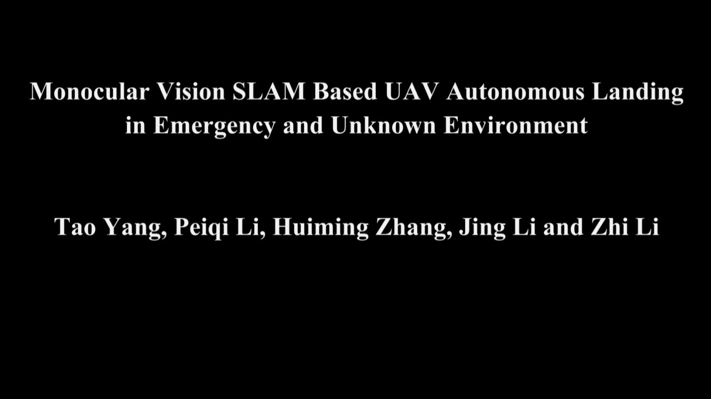

## Abstract

With the popularization and wide application of drones in military and civilian fields, the safety of drones has to be considered. At present, the failure rate and drop rate of drones are still much higher than that of manned aircraft. Therefore, it is imperative to improve the research on the safe landing and recovery of drones. However, most drone navigation methods rely on GPS signals. When GPS signals are missing, these drones cannot land or recover properly. In fact, with the help of optical equipment and image recognition technology, the position and posture of the drone in the three dimensional world can be obtained, and the environment where the drone are located can be perceived. In this paper, based on monocular visual simultaneous localization and mapping (SLAM), we present an algorithm of autonomous landing area selection for drones in an emergency and unstructured environment. First, a drone scans the scene, acquires key frames in the SLAM system to estimate the pose of the drone and to create a three dimensional point cloud map. Then, the filtered three-dimensional point cloud map is converted into a grid map. The grid map is further divided into different regions to select the appropriate landing zone. Thus it can carry out autonomous route planning. Finally, when it stops upon the landing field, it will start the descent mode near the landing area. As a visual landing technology, we evaluate the proposed algorithm on two tasks: scene reconstruction integrity and landing location security. Experiments in multiple sets of real scenes show that the environmental awareness and the landing area selection have high robustness and real-time performance.

### Demo

 [Demo](http://v.youku.com/v_show/id_XMzU0MDgxMjIwMA==.html?spm=a2h3j.8428770.3416059.1) video for Monocular Vision SLAM Based UAV Autonomous Landing in Emergency and Unknown Environment.

### Reference

submitted to Electronics
